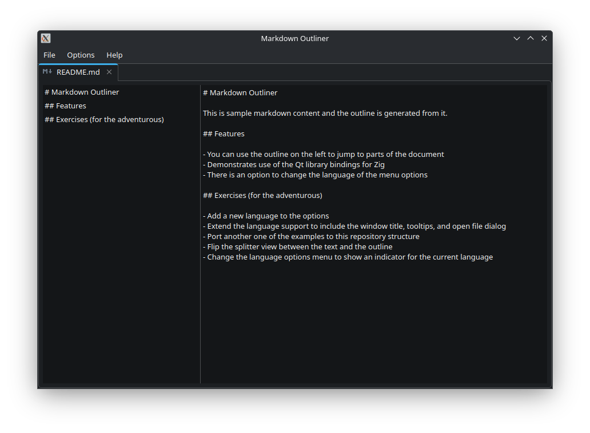
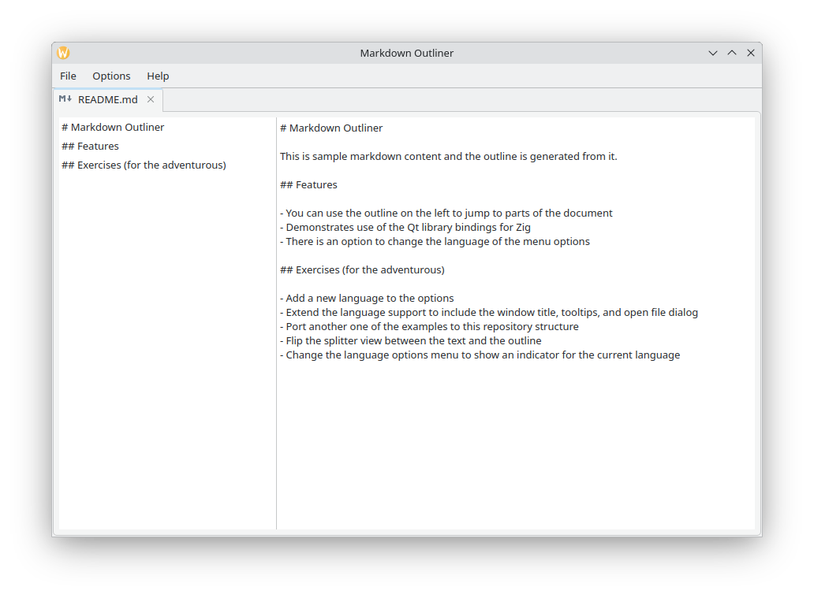
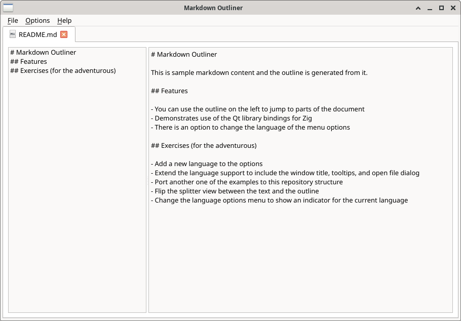
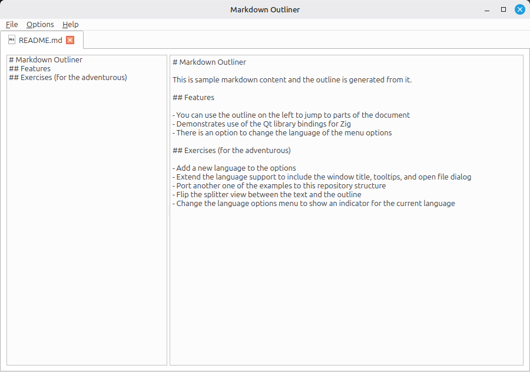
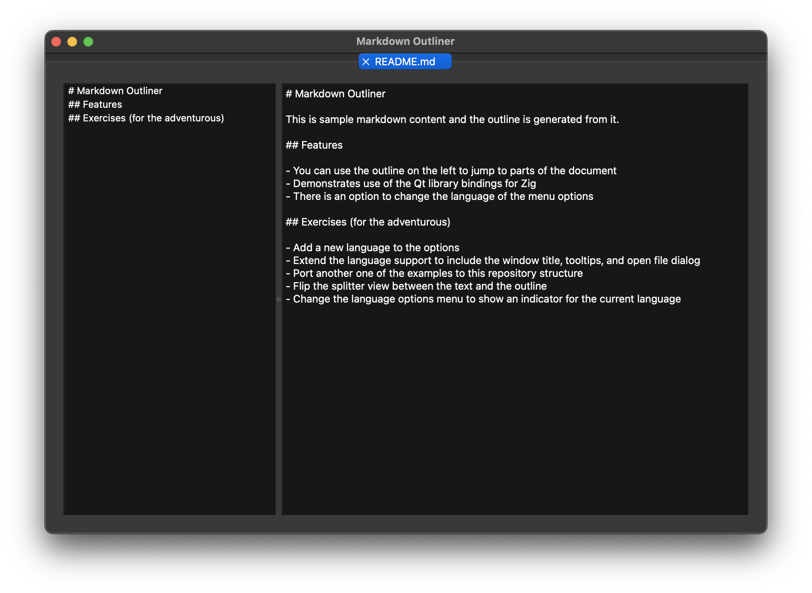
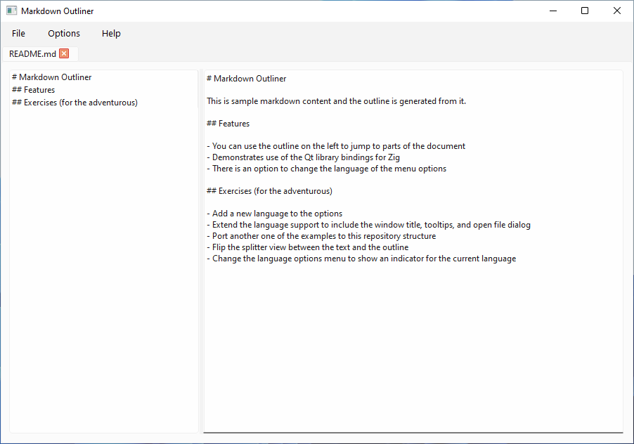

###

<div align="center">


[-fdc009?logo=zig&logoColor=f7a41d&label=Zig)](https://ziglang.org/download/)

[](https://github.com/rcalixte/libqt6zig-demo/actions/workflows/builds.yml)
</div>

---

Demo application using the [MIT-licensed Qt 6 bindings for Zig](https://github.com/rcalixte/libqt6zig)

This demo application can be thought of as a simpler instructive template for using the main library than the [examples](https://github.com/rcalixte/libqt6zig-examples). Please try out the demo application and start a [discussion](https://github.com/rcalixte/libqt6zig/discussions) if you have any questions or issues relevant to this demo application.

---

### TABLE OF CONTENTS

- [License](#license)
- [Building](#building)
  - [FreeBSD (native)](#freebsd-native)
  - [Linux (native)](#linux-native)
    - [Debian-based distributions](#debian-based-distributions)
    - [Fedora-based distributions](#fedora-based-distributions)
    - [Arch-based distributions](#arch-based-distributions)
  - [macOS (native)](#macos-native)
  - [Windows (native)](#windows-native)
- [Screenshots](#screenshots)
- [FAQ](#faq)
  - [Q1. How long does it take to compile the demo application?](#q1-how-long-does-it-take-to-compile-the-demo-application)
  - [Q2. What build modes are supported by the demo application?](#q2-what-build-modes-are-supported-by-the-demo-application)
- [Special Thanks](#special-thanks)

License
-------

The demo application within `libqt6zig-demo` is licensed under the MIT license.

Building
--------

---

### FreeBSD (native)

```bash
sudo pkg install qt6-base
```

> [!NOTE]
> The `zig` package will need to be downloaded and installed separately if the latest stable version is not available in the default repositories.

---

### Linux (native)

#### Debian-based distributions

```bash
sudo apt install gcc libstdc++-14-dev-$(dpkg --print-architecture)-cross qt6-base-dev
```

> [!NOTE]
> The `zig` package must be downloaded and installed separately.

#### Fedora-based distributions

```bash
sudo dnf install gcc libstdc++-devel qt6-qtbase-devel
```

> [!NOTE]
> The `zig` package will need to be downloaded and installed separately if the latest stable version is not available in the default repositories.

#### Arch-based distributions

```bash
sudo pacman -S gcc qt6-base
```

> [!NOTE]
> The `zig` package will need to be downloaded and installed separately if the latest stable version is not available in the default repositories.

---

### macOS (native)

To install the Qt 6 dependency using [Homebrew](https://brew.sh/):

```bash
brew install qt6
```

> [!IMPORTANT]
> In recent versions of Qt 6, the symlinks are not correctly created at the time of installation and must be created manually for each framework. For the demo application, the following commands can be used to create the symlinks:
>
> ```bash
> ln -s /opt/homebrew/lib/QtCore.framework/Headers /opt/homebrew/include/QtCore
> ln -s /opt/homebrew/lib/QtGui.framework/Headers /opt/homebrew/include/QtGui
> ln -s /opt/homebrew/lib/QtWidgets.framework/Headers /opt/homebrew/include/QtWidgets
> ```

The official Qt installer is also supported but will require manually creating the symlinks as above and using the `extra-paths` option described below, using the root of the include directory as the path value.

> [!NOTE]
> The `zig` package will need to be downloaded and installed separately if the latest stable version is not available via Homebrew.

---

### Windows (native)

For Windows, use the official Qt installer and install a Qt version built with LLVM-MinGW.

> [!NOTE]
> The `zig` package will need to be downloaded and installed separately.

---

Once the required packages are installed, the demo application can be built from the root of the repository:

```bash
zig build
```

To build and run the demo application:

```bash
zig build run
```

In the event that another system library path is needed e.g. a different Qt installation path, the `extra-paths` option supports this use case:

```bash
zig build -Dextra-paths="C:/Qt/6/llvm-mingw_64"
```

or

```bash
zig build -Dextra-paths={"/opt/qt6","/opt/lib/qt6"}
```

For Windows hosts, there is an additional option to specify the Qt installation directory. This is only required if passing in an alternate extra library path meant to override the default Qt library path:

```bash
zig build -Dextra-paths="C:/Qt/6/llvm-mingw_64" -DQTDIR="C:/Qt/6/llvm-mingw_64"
```

The demo application can be installed to the system in a non-default location by adding the `--prefix-exe-dir` option to the build command:

```bash
sudo zig build --prefix-exe-dir /usr/local/bin # creates /usr/local/bin/mdoutliner
```

The source code for the demo application can be found in the `src` directory of the repository.

Screenshots
-----------

<table align="center">

|          |
| :----------------------------------------: |
|               CachyOS + KDE                |
|        |
|                Fedora + KDE                |
|    |
|               FreeBSD + Xfce               |
|  |
|           Linux Mint + Cinnamon            |
|                  |
|                   macOS                    |
|              |
|                  Windows                   |

</table>

FAQ
---

### Q1. How long does it take to compile the demo application?

The first compilation should take less than a minute, far less on more recent or capable hardware.

### Q2. What build modes are supported by the demo application?

Currently, only `ReleaseFast`, `ReleaseSafe`, and `ReleaseSmall` are supported. The `Debug` build mode is not supported. This may change in the future. The default build mode is `ReleaseFast`. To change the build mode:

```bash
zig build -Doptimize=ReleaseSmall
```

or

```bash
zig build --release=small
```

Special Thanks
--------------

- [@mappu](https://github.com/mappu) for the [MIQT](https://github.com/mappu/miqt) bindings that provided the phenomenal foundation for this project

- [@arnetheduck](https://github.com/arnetheduck) for proving the value of collaboration on the back-end of the library while working across different target languages
